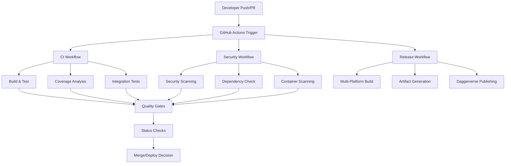
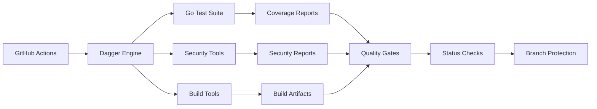

# Design Document

## Overview

This design implements a comprehensive GitHub Actions CI/CD pipeline for the Dagger GitHub Actions Auto-Fix Agent project (https://github.com/tosin2013/dagger-autofix.git). The solution provides automated building, testing, security scanning, and deployment capabilities with a focus on achieving and maintaining 85%+ test coverage for all releases.

The design leverages GitHub Actions workflows, Dagger containerization, Go testing frameworks, and modern DevOps practices to create a robust, scalable, and maintainable CI/CD pipeline that supports the project's multi-LLM architecture and automated failure resolution capabilities.

## Architecture

### High-Level Architecture



### Workflow Architecture

The CI/CD system consists of four main workflow categories:

1. **Continuous Integration (CI)**: Triggered on push/PR for code validation
2. **Security & Compliance**: Automated security scanning and vulnerability assessment
3. **Release Management**: Automated release builds and artifact publishing
4. **Quality Assurance**: Coverage enforcement and quality gates

### Component Integration



## Components and Interfaces

### 1. GitHub Actions Workflows

#### Primary CI Workflow (`.github/workflows/ci.yml`)
- **Purpose**: Main continuous integration pipeline
- **Triggers**: Push to any branch, pull request creation/update
- **Responsibilities**:
  - Code checkout and environment setup
  - Dependency caching and installation
  - Build validation
  - Unit and integration test execution
  - Coverage analysis and reporting
  - Quality gate enforcement

#### Security Workflow (`.github/workflows/security.yml`)
- **Purpose**: Comprehensive security scanning
- **Triggers**: Push to main branches, scheduled runs, security events
- **Responsibilities**:
  - Static security analysis (gosec)
  - Dependency vulnerability scanning (govulncheck)
  - Container image security scanning
  - License compliance checking
  - Security report generation

#### Release Workflow (`.github/workflows/release.yml`)
- **Purpose**: Automated release management
- **Triggers**: Release tag creation, manual dispatch
- **Responsibilities**:
  - Multi-platform binary compilation
  - Container image building and publishing
  - Artifact signing and checksum generation
  - GitHub release creation
  - Daggerverse publishing

#### Coverage Enforcement Workflow (`.github/workflows/coverage.yml`)
- **Purpose**: Dedicated coverage analysis and enforcement
- **Triggers**: Pull requests, scheduled runs
- **Responsibilities**:
  - Comprehensive test coverage analysis
  - Coverage trend tracking
  - Coverage badge generation
  - Coverage gate enforcement

### 2. Dagger Integration Layer

#### Build Container Configuration
```go
type BuildConfig struct {
    BaseImage     string
    GoVersion     string
    Dependencies  []string
    Environment   map[string]string
    CacheKeys     []string
}
```

#### Test Execution Container
```go
type TestContainer struct {
    TestFramework string
    CoverageTools []string
    TestTimeout   time.Duration
    Parallelism   int
}
```

### 3. Coverage Analysis System

#### Coverage Collector
- **Interface**: Collects coverage data from multiple test runs
- **Formats**: Supports Go coverage, LCOV, Cobertura formats
- **Aggregation**: Combines coverage from unit, integration, and functional tests
- **Reporting**: Generates HTML, JSON, and badge formats

#### Coverage Validator
- **Thresholds**: Enforces 85% minimum coverage requirement
- **Trend Analysis**: Tracks coverage changes over time
- **Failure Handling**: Blocks builds that don't meet coverage requirements
- **Reporting**: Provides detailed coverage breakdowns by package/file

### 4. Security Integration

#### Static Analysis Tools
- **gosec**: Go security analyzer for common security issues
- **govulncheck**: Go vulnerability database checker
- **nancy**: Dependency vulnerability scanner
- **trivy**: Container and filesystem vulnerability scanner

#### Security Report Aggregator
- **SARIF Support**: Standardized security report format
- **GitHub Security Tab**: Integration with GitHub security features
- **Severity Classification**: Critical, High, Medium, Low categorization
- **False Positive Management**: Suppression and whitelist capabilities

### 5. Quality Gates System

#### Gate Definitions
```yaml
quality_gates:
  coverage:
    minimum: 85
    trend: non-decreasing
  security:
    critical: 0
    high: 0
    medium: 5
  tests:
    success_rate: 100
    timeout: 10m
  build:
    success: required
    warnings: allowed
```

#### Gate Enforcement
- **Pre-merge Checks**: All gates must pass before merge
- **Override Mechanism**: Emergency override with approval
- **Notification System**: Alerts for gate failures
- **Metrics Collection**: Gate performance tracking

## Data Models

### 1. Workflow Configuration

```yaml
# Workflow metadata
name: string
description: string
triggers:
  - push: branches[]
  - pull_request: branches[]
  - schedule: cron
  - workflow_dispatch: inputs{}

# Job configuration
jobs:
  - name: string
    runs_on: string
    timeout: duration
    strategy: matrix
    steps: []
    environment: variables{}
```

### 2. Test Results

```go
type TestResults struct {
    TotalTests    int                    `json:"total_tests"`
    PassedTests   int                    `json:"passed_tests"`
    FailedTests   int                    `json:"failed_tests"`
    SkippedTests  int                    `json:"skipped_tests"`
    Duration      time.Duration          `json:"duration"`
    Coverage      CoverageReport         `json:"coverage"`
    Failures      []TestFailure          `json:"failures"`
    Metadata      map[string]interface{} `json:"metadata"`
}

type CoverageReport struct {
    OverallCoverage float64                    `json:"overall_coverage"`
    PackageCoverage map[string]float64         `json:"package_coverage"`
    FileCoverage    map[string]FileCoverage    `json:"file_coverage"`
    Thresholds      CoverageThresholds         `json:"thresholds"`
    TrendData       []CoverageTrend            `json:"trend_data"`
}
```

### 3. Security Scan Results

```go
type SecurityScanResult struct {
    ScanID        string                 `json:"scan_id"`
    Timestamp     time.Time              `json:"timestamp"`
    Scanner       string                 `json:"scanner"`
    Vulnerabilities []Vulnerability      `json:"vulnerabilities"`
    Summary       SecuritySummary        `json:"summary"`
    SARIF         interface{}            `json:"sarif"`
}

type Vulnerability struct {
    ID          string    `json:"id"`
    Title       string    `json:"title"`
    Description string    `json:"description"`
    Severity    string    `json:"severity"`
    CVSS        float64   `json:"cvss"`
    Package     string    `json:"package"`
    Version     string    `json:"version"`
    FixedIn     string    `json:"fixed_in"`
    References  []string  `json:"references"`
}
```

### 4. Build Artifacts

```go
type BuildArtifacts struct {
    Version     string                 `json:"version"`
    Commit      string                 `json:"commit"`
    Timestamp   time.Time              `json:"timestamp"`
    Binaries    []BinaryArtifact       `json:"binaries"`
    Containers  []ContainerArtifact    `json:"containers"`
    Checksums   map[string]string      `json:"checksums"`
    Signatures  map[string]string      `json:"signatures"`
}

type BinaryArtifact struct {
    Name     string `json:"name"`
    Platform string `json:"platform"`
    Arch     string `json:"arch"`
    Size     int64  `json:"size"`
    Path     string `json:"path"`
    Checksum string `json:"checksum"`
}
```

## Error Handling

### 1. Workflow Failure Handling

#### Retry Strategy
- **Transient Failures**: Automatic retry with exponential backoff
- **Network Issues**: Up to 3 retries for network-related failures
- **Resource Constraints**: Queue management and resource allocation
- **Timeout Handling**: Graceful timeout with partial results

#### Failure Classification
```go
type WorkflowFailure struct {
    Type        FailureType    `json:"type"`
    Stage       string         `json:"stage"`
    Severity    Severity       `json:"severity"`
    Message     string         `json:"message"`
    Context     interface{}    `json:"context"`
    Recoverable bool           `json:"recoverable"`
    Actions     []string       `json:"suggested_actions"`
}

const (
    BuildFailure FailureType = iota
    TestFailure
    CoverageFailure
    SecurityFailure
    DeploymentFailure
    InfrastructureFailure
)
```

#### Notification System
- **Slack Integration**: Real-time failure notifications
- **Email Alerts**: Critical failure notifications
- **GitHub Issues**: Automatic issue creation for persistent failures
- **Dashboard Updates**: Real-time status dashboard updates

### 2. Coverage Failure Handling

#### Coverage Drop Detection
- **Threshold Monitoring**: Continuous monitoring of coverage levels
- **Trend Analysis**: Detection of coverage degradation patterns
- **Root Cause Analysis**: Identification of coverage drop causes
- **Remediation Suggestions**: Automated suggestions for coverage improvement

#### Recovery Mechanisms
- **Test Generation**: Automated test generation for uncovered code
- **Coverage Exclusions**: Management of legitimate coverage exclusions
- **Baseline Adjustment**: Controlled baseline adjustments with approval
- **Technical Debt Tracking**: Coverage debt tracking and management

### 3. Security Failure Handling

#### Vulnerability Response
- **Severity-Based Actions**: Different responses based on vulnerability severity
- **Auto-Patching**: Automated dependency updates for known fixes
- **Quarantine**: Isolation of vulnerable components
- **Rollback**: Automatic rollback for critical security issues

#### Compliance Monitoring
- **Policy Enforcement**: Automated policy compliance checking
- **Audit Trails**: Comprehensive audit logging
- **Reporting**: Regular compliance reports
- **Remediation Tracking**: Progress tracking for security issues

## Testing Strategy

### 1. Test Categories

#### Unit Tests
- **Scope**: Individual functions and methods
- **Coverage Target**: 90%+ for core business logic
- **Execution**: Fast, isolated, no external dependencies
- **Frameworks**: Go testing, testify, gomock

#### Integration Tests
- **Scope**: Component interactions and API integrations
- **Coverage Target**: 80%+ for integration paths
- **Execution**: Medium speed, controlled external dependencies
- **Frameworks**: Testcontainers, Docker Compose

#### End-to-End Tests
- **Scope**: Complete workflow validation
- **Coverage Target**: 70%+ for critical user journeys
- **Execution**: Slower, real external dependencies
- **Frameworks**: Dagger test containers, GitHub API

#### Performance Tests
- **Scope**: Performance regression detection
- **Metrics**: Response time, throughput, resource usage
- **Execution**: Scheduled and on-demand
- **Tools**: Go benchmarks, load testing tools

### 2. Test Execution Strategy

#### Parallel Execution
```yaml
test_matrix:
  go_version: [1.19, 1.20, 1.21]
  os: [ubuntu-latest, macos-latest, windows-latest]
  test_type: [unit, integration, e2e]
  
parallel_jobs: 6
timeout: 30m
```

#### Test Isolation
- **Container Isolation**: Each test suite runs in isolated containers
- **Data Isolation**: Separate test databases and resources
- **Network Isolation**: Isolated network environments
- **State Management**: Clean state between test runs

#### Test Data Management
- **Fixtures**: Standardized test data sets
- **Factories**: Dynamic test data generation
- **Cleanup**: Automatic test data cleanup
- **Versioning**: Test data versioning and migration

### 3. Coverage Analysis

#### Coverage Collection
```go
type CoverageCollector struct {
    Sources     []string
    Exclusions  []string
    Formats     []string
    Aggregation AggregationStrategy
}

type CoverageMetrics struct {
    LineCoverage     float64
    BranchCoverage   float64
    FunctionCoverage float64
    PackageCoverage  map[string]float64
}
```

#### Coverage Reporting
- **HTML Reports**: Interactive coverage reports
- **JSON Reports**: Machine-readable coverage data
- **Badge Generation**: Coverage badges for README
- **Trend Analysis**: Historical coverage tracking

#### Coverage Enforcement
- **Gate Configuration**: Configurable coverage thresholds
- **Exemption Management**: Managed exemptions for specific code
- **Trend Monitoring**: Coverage trend analysis and alerts
- **Improvement Tracking**: Coverage improvement goal tracking

## Implementation Phases

### Phase 1: Core CI Pipeline (Week 1-2)
1. **Basic Workflow Setup**
   - Create primary CI workflow
   - Configure Go environment and caching
   - Implement basic build and test execution
   - Set up status checks and branch protection

2. **Coverage Integration**
   - Integrate Go coverage tools
   - Implement coverage reporting
   - Set up 85% coverage threshold
   - Create coverage status checks

### Phase 2: Security Integration (Week 2-3)
1. **Security Scanning**
   - Integrate gosec for static analysis
   - Add govulncheck for vulnerability scanning
   - Implement container security scanning
   - Set up security reporting

2. **Quality Gates**
   - Implement security quality gates
   - Configure failure handling
   - Set up notification system
   - Create security dashboards

### Phase 3: Release Automation (Week 3-4)
1. **Release Workflow**
   - Create automated release pipeline
   - Implement multi-platform builds
   - Set up artifact signing and checksums
   - Configure GitHub release creation

2. **Daggerverse Integration**
   - Implement Daggerverse publishing
   - Set up automated module updates
   - Configure version management
   - Create release documentation

### Phase 4: Advanced Features (Week 4-5)
1. **Performance Testing**
   - Add performance regression tests
   - Implement benchmark tracking
   - Set up performance alerts
   - Create performance dashboards

2. **Monitoring and Observability**
   - Implement comprehensive metrics
   - Set up alerting and notifications
   - Create operational dashboards
   - Add audit logging

### Phase 5: Optimization and Documentation (Week 5-6)
1. **Performance Optimization**
   - Optimize workflow execution times
   - Implement advanced caching strategies
   - Optimize resource usage
   - Fine-tune parallel execution

2. **Documentation and Training**
   - Create comprehensive documentation
   - Develop troubleshooting guides
   - Create developer onboarding materials
   - Implement knowledge sharing sessions